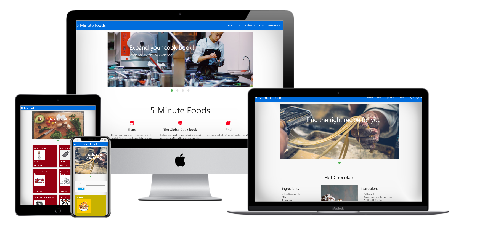
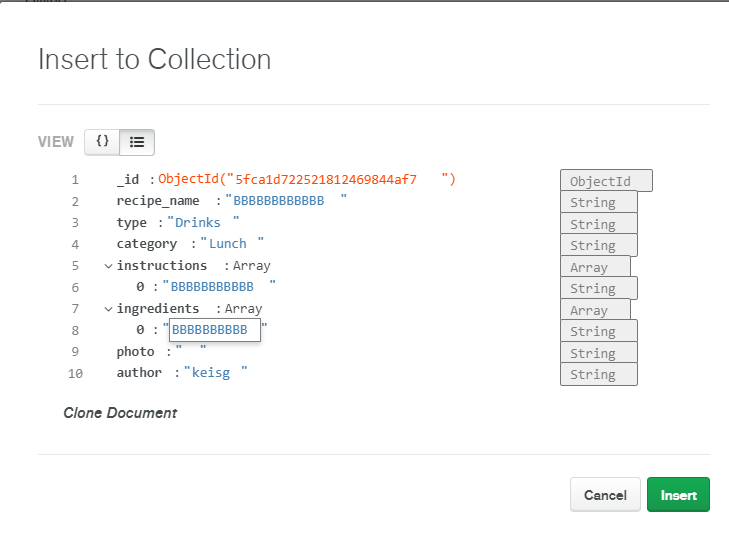
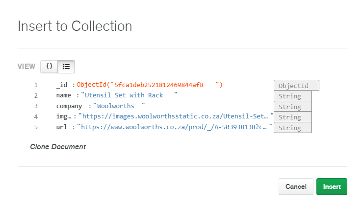
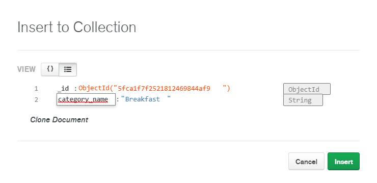
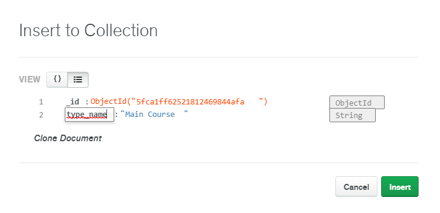
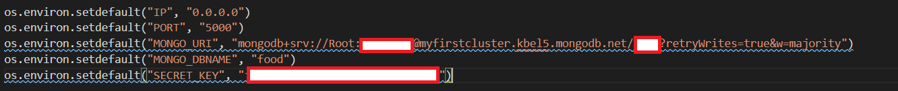

# 5 Minute Foods

5 Minute Foods was initially a Pokédex for "Pokémon Go" but was re-mastered to be a site, where people can share recipes.
5 Minute Foods was inspired by the heaps of hand written recipes in my parents' kitchen. My mom would always try and find recipes from relatives; some recipes did not exist on paper. So to make finding and sharing recipes easier, 5 Minute Foods was born. The name originates from my laziness; I would not spend more than 5 minutes looking and sharing recipes. 

## Table of contents

<!--table start-->

- [UX](#UX)
    - [User Stories](#User-Stories)
    - [Strategy Plane](#Strategy-plane)
    - [Scope Plane](#Scope-Plane)
    - [Structure Plane](#Structure-Plane)
    - [Skeleton Plane](#Skeleton-Plane)
    - [Surface Plane](#Surface-Plane)
- [Features](#Features)
    - [Existing Features](#Existing-Features)
    - [Features Left to Implement](#Features-Left-to-Implement) 
- [Technologies Used](#Technologies-Used)
    - [Languages](#Languages)
    - [Tools](#Tools)
    - [Frameworks](#Frameworks)
    - [Libraries](#Libraries)
- [Testing](#Testing)
- [Deployment](#Deployment)
    - [Online Deployment](#Online-deployment)
    - [Offline Deployment](#Offline/Local-Deployment)
- [Credits](#Credits)
    -[Content](#Content)
    -[Media](#Media)
    -[Acknowledgements](#Acknowledgements)
<!--table end-->

---
 
# UX
## User Stories

- As a Non-registered User I want to:
    - Find a recipe quickly
        - Click on the "Find" button in the Nav bar and search through the catalogue or search the recipe's name 
    - Register to become a registered user
        - To register a user clicks on the "login/register" button in the Nav bar and click the registration button
        - Users must then fill out a form and will then be registered
    
- As a registered User I want to:
    - Share, update and delete my recipes 
        - Firstly to share a recipe a user must click on the "share" button in the Nav bar and input the detail of the recipe in the form
        - Only if a User created *that* recipe, will they be able to update and delete that recipe
    - I want the ability to sign in and out
        - To sign in a user clicks on the "login/register" button in the nav bar and fill out the form with their details
        - Once a User wishes to sign out, they click the "logout" button in the nav bar

- As the Administrator I want to:
    - Promote cooking appliances to my users
        - There will be an "appliances" button in the nav bar for all users to click on where appliances will be on display

## Strategy Plane
### High level considerations
-	Looking at the target audience: This is a very culturally appropriate project. 
It is a web app that focuses on sharing recipes. 
-	Anybody can use this web app. The content will focus on recipes and food. 
-	We can track and catalogue the content in an intuitive way by using forms and databases with collections in MongDB
-	The content will be entered into a database and be displayed to the different pages
-	Cook books require people to buy the books while this web app provides the recipes for free
-	The technology we are using is very modern: HTML5, CSS3, JavaScript, Python3 and MongoDB

### Business goals 

Due to the assessment, business goals are negligible. 

### Trade Off 

-	I am making a Web app that allows people to find and share recipes  
-	The value we provide is to be able to quickly find recipes and share them. 
-	Anyone is allowed to use the website
-	People looking for recipes are people who do not know what to make for breakfast/dinner/lunch so we aim to provide as many recipes for these as possible. 
-	Competitors normally share their recipes in a blog which makes it tedious because as a user, we do not care about the blogger’s life story regarding that recipe, we just want the recipe. 
-	Competitors who share their recipes on non-blog sites normally share gifs of their recipe on forums (Reddit) but without knowing that you can control the gif makes it long to find the next step because you will have to wait for the gif to replay before you can see the next step. 
-	User needs: 
    - Easily find and share recipes 
-	Site owner’s goal:
    - Promote cooking equipment (AMC Classic (?)) (Maybe)
-	Will need to have minimum features for single use learning

### The trade off

- I have rated each feature from 1 - 5 (where 1 is the least and 5 is the most) on importance and viability

- First I add up the total on importance, which is 33

- Then I find my average viability, which is 4.25. Then I multiply that by the number of items, which is 34. 

- My importance "value" is 33 and my viability is 34. Thus viability > importance
    - This means that all features can be implemented

- Depending on the time constraints the items with the lowest importance will be incorporated last
## Scope Plane

### Trade off

- The features that are open for discussion at the moment (16/11/2020) (DD/MM/YYYY) is the Promotion of Products and the comment section on each recipe because they have the lowest viability of all the features

- The project should be done within 3 weeks 
    - I have 21 days to implement 8 features
    - This means one feature should be implemented every +-3 days  

#### Comments

- An issue with the comment section is:
    - All comments will just appear as paragraphs in cards and will not satisfy first time learning and lead to a bad UX. 
    - Further research will have to be done to be able to incorporate a voting system to rate the most helpful comments and to permanently show each comment to the correct url. 
        - This leads to another issue: how do I prevent a user voting more than once?

- Thus, I believe the comment section should not be included. 

#### Promotion of products

- A collection can be established with images, names and links of certain cooking equipment used in the different recipes and these can be used to promote products. (Linking user to the Official product site)

### Requirements
- I conducted an interview with my family regarding this section asking them 3 main questions
    - What do the users say they need?
        -  One User wanted a conversion Table
            - This can be incorporated under each recipe's individual page 
        - One user wants media - photos/gifs of the recipe
            - This can also be incorporated in each recipe's individual page
            - If broken links are submitted a default image will appear instead
        - Users said they wanted a difficulty level for each recipe
            - I found this to be relative to each person and can lead to intimidation - Thus bad User experience
        - One user said they wanted cooking tips at the side but this is so niche to each recipe
            - This was not included
        - Another user wanted the recipes to already be on the app
            - Some recipes will exist but they won’t be as abundant
        - Users want to know if the recipe was tested by different users
            - This will rely on a comment section, which will not be included
        - Users wanted categories for each recipe
            - Main course, sides, desserts etc...
            - There has to be a limit of categories
        - Users wanted cooking "teachings" to teach people using the app how to cooking
            - But this misses the site's goal and can be considered negligible 
        - Users wanted a filtering system to be able to filter their searches by difficulty
            - This can be done by creating an index in MongoDB 
            - Instead a search feature was added to be able to search for recipes by name
        - Users wanted to share the recipes via pictures but this going to lead to recipes being misread and/or misunderstood

    - What they actually need? 
        - Users were unaware of the requirements:
            - To have a responsive design 
            - To have a navigation system
        
    - What they do not know they need?
        - The submission form here is crucial since this is the only logical way to get the recipe online in a clear and comprehensive manner.
        - Users were unaware of the importance of the wireframes and the surface plane.
        - A session cookie will prevent random users from updating and deleting recipes they did not create

### Requirement types

- Looking at the content requirements there will be a lot of mixed content of the multiple pages
    - Images/ gifs, Cards, Ordered and Unordered lists with a lot of text

- considering the viability of the scope plane requirements I would say that the requirements we can include (outside of the initial features) are:
    - The conversion Table
    - Media/ gifs of the recipe
    - The categories for when the meal is applicable (dinner/lunch/breakfast etc.). These will be stored in a database and they will be part of a drop down list in the submission form
    - The filtering system/search functionality 
- The requirements can't include due to viability is:
    - The difficulty level
        - I support this idea but difficulty is relevant: Gordon Ramsey might find roast beef simple but a 15 year old could find it challenging/dangerous
    - The cooking tips
        - I can attempt to include this but if it makes the database full then it will probably not be included
    - The comment section as discussed

- The requirements listed are not features but they are "nice to haves"
- Incorporating them could round off this project quite nicely and make the projects seem more useful, buildable, objective and functional

- A non-functional requirement I am seeing is scalability 
    - I will have to move to a better, larger server if the traffic gets too big
        - This means setting up new environment variables which can be done but will definitely cost money

## Structure Plane
### Concerns

- The following diagram displays how I plan to organize the functionality & content of the site and how a user might navigate through the site intuitively 

- The user will start at the landing page 
- At the top will be a nav bar with 5 sections: Share, Find, About, Appliances and Home
    - "Share" will be a submission form - only available to registered users
    - "Find" will be a gallery/catalogue with a filter that uses advanced routing to direct a user to an individual recipe, where the user who created the recipe can edit or delete a recipe
    - "About" will give a bit more information on the project's background
    - "Appliances" will be a gallery of appliances from a collection that links a user to the official site of that appliance
    - "Home" will take a user to the landing page

- The plan is to have a linear hyperlinked structure that is simple enough for users to navigate through but complex enough to include a lot of information

### Interaction design 

- Firstly looking at how the databases and collections are going to be set up
- Here are screenshots of how the collections look like. NOTE the type of each data field is stated in the screenshots

The recipe collection

The appliance collection

The Category collection

The type collection

The user collection

- The Recipe collection will be the "main" database where each entry will have attributes:
    - category_name: This will "categorise" the recipes for the corresponding meal times
    - type: This will also categorise the recipes but for what type of dish it is.
    - Name: will be the name of the recipe, the search functionality will target this attribute
    - instructions and ingredient: these two fields will be in the form of an array of strings. By using Java Script 
    I plan to create more input fields in the form. For each input field (for the two attributes), that will get pushed into the corresponding array to MongoDB. 
        - To get this to appear on the recipe's page, I will filter through each item in the array displaying the ingredients in an `<li></li>` child of an `<ul></ul>` and the instructions in an `<li></li>` that is a child of an `<ol></ol>`
    - Img: this will be a URL of a gif or an image of the meal 
    - Finally each database will have a Primary key auto generated by MongoDB called "_id"

- All input fields will be required except for the photo.

- Looking at the interactive systems discussed so far:
    - The ability to update and delete recipes
        - Only the user who created the recipe is able to update and delete that recipe
        - The update button will redirect a user to a form that is filled with that recipe's data
        - The delete button will trigger a modal for defensive programming and on the modal; the delete button will delete the recipe
    - The gallery/catalogue of recipe cards to click on
        - Each recipe will be in a card which when clicked on will take you to that recipe's page
        - There will be a search bar above all the cards that allows the users to search for recipe names
    - The form on the landing page
        - A user is able to fill out that form and message the admin, but due to the API not being installed; only a flashed message will appear
        - All form elements require data or else the form will not submit
    - The update form
        - As discussed above the recipe's site will have a update button
        - clicking on it will redirect the user to a populated form
        - Data can be changed there and be resubmitted to change the original recipe
    - The submission form to submit recipes
        - There are input fields to enter data 
        - If more ingredients/instructions need to be added there will be a button that "reveals"/"adds" more input fields
        - On submission the form's data will get pushed to the database where the recipe will be on display in the "Find" section
    - The appliance page to promote appliances for the page owner
        - This will be a simple gallery that will send a user to the site selling those appliances
    - There will be a log in and registration form for a user to register and log into
        - So that users can share recipes and delete/update their own

- The Site will try to Leverage from Prior experience by assuming the user has an expectation of convention
    - Like having the Nav Bar at the top of the page

- The Theme of the page will be consistent 

- By using a Library like materialize the voice of the site will remain consistent and stable

- Due to the simplicity of the structure of the site, the app/site should be very learnable

### Information Architecture

- This section is responsible for the creation of organisation and navigational schemes which has already been discussed in the structure plane concerns and the interaction design. 

- The architecture, I believe, is done correctly so that when changes are made the architecture can accommodate those changes

- The architecture forms a Tree Structure which is relatively standard
    - This is known to be problematic on Mobile but with the ease of a burger icon, I plan to reduce those problems

### Principals of organisation

- The way data will be organised as follows:
    - The organising principles used at the highest levels of the site should be most closely tied to user needs & business objectives
        - That means a link to share/find a recipe should be in the navigation bar
        - The link to promote cooking appliances should also be in the Nav
    - Organising rules at lower levels are influenced by future specs & content requirements
        - Like the comment section 
        - Or having more information on a recipe on another site

## Skeleton Plane

Here are the wireframes of the site for different modern devices 
- [Desktop view](Readme_sourceFiles/DesktopWireframe.pdf)

- [Mobile & Tablet view](Readme_sourceFiles/MobileAndTabletView.pdf)

## Surface Plane

To add Visual language to the site, here are the design choices I made.

- This is the designated colour pallet 

- I want flash messages and recipe cards to be a shade of yellow
- Submission buttons, Update & delete buttons must be red
- Main sections of the site must be buildable
    - Like the nav bar

- The font family will remain consistent and will be the standard materialize font.

- Regarding images:
    - Images in the cards of the "appliances" and "find" section must be contained and square
    - A default image must be provided if there is an error rendering that image

- Each section of the site will have a cover photo while the landing page has a carousel but the images in the carousel need to be the same as the images in the cover photo

# Features
 
## Existing Features
- Form on landing page 
    - Allows users to contact the site owner, by having them fill out a form
- Sharing recipes 
    - Users can share recipes by filling out the form on the "share" section
    - Users will first have to be registered and/or logged in
- Finding recipes
    - Users are able to scroll through the cards on the "find" section 
    - Users can search for recipe names in the search bar at the top of the "find" section 
    - Clicking on the recipe's link will take a user to a more detailed site on that recipe
    - Users who submitted that recipe are able to update and delete that recipe
- Updating recipes
    - Clicking on a individual recipes link and scrolling down will expose the update button - If the user who created it is logged in
    - Clicking on that button collects all previously entered data in the "share form" and allows a user to modify anything they like
    - Clicking on submit will update that recipe
- Deleting a recipe
    - Clicking on a individual recipes link and scrolling down will expose the delete button - If the user who created it is logged in
    - Clicking on that button activates a modal for defensive programming 
    - Clicking on Cancel closes the modal 
    - Clicking on delete deletes that recipe. 
- Appliances Promotion
    - In the "appliances" section there are cards with different appliances
    - Clicking on the individual links takes a user to the official site where that appliance will be sold.

## Features Left to Implement
- I want to incorporate pagination in the "find" section
- I want to advance my search bar's abilities by adding more indexing in the recipes collection
- I want to add a comment section under each recipe's individual page with a voting system
- I want to add a "cross" at the top right of each card in the find section, so that deleting recipes are easier

# Technologies Used

In this section, you should mention all of the languages, frameworks, libraries, and any other tools that you have used to construct this project. For each, provide its name, a link to its official site and a short sentence of why it was used.

## Languages

- [HTML5](https://en.wikipedia.org/wiki/HTML5)
- [CSS3](https://en.wikipedia.org/wiki/Cascading_Style_Sheets#CSS_3)
- [JavaScript](https://en.wikipedia.org/wiki/JavaScript)
- [Pyhton3](https://www.python.org/downloads/release/python-380/)

### Tools

- [Autoprefixer](https://autoprefixer.github.io/)
- [Markup Validation service](https://validator.w3.org/)
- [Pep8 online check](http://pep8online.com/)
- [GitHub](https://github.com/)
- [Git](https://git-scm.com/)
- [Gitpod](https://chrome.google.com/webstore/detail/gitpod-online-ide/dodmmooeoklaejobgleioelladacbeki?hl=en)
- [VSC](https://code.visualstudio.com/download)
- [Microsoft Office](https://www.office.com/)
- [favicon](https://www.favicon.cc/)
- [JSHint](https://jshint.com/)

### Frameworks

- [Materialize](https://materializecss.com/)
- [Font Awesome icons](https://fontawesome.com/icons?d=gallery)

The following are frameworks imported from the cheese shop (They can be found in requirements.txt). 
- [Flask](https://pypi.org/project/Flask/)
- [PyMongo](https://pypi.org/project/pymongo/)
- [Click](https://pypi.org/project/click/)
- [DNSPython](https://pypi.org/project/dnspython/)
- [Flask-PyMongo](https://pypi.org/project/Flask-PyMongo/)
- [itsdangerous](https://pypi.org/project/itsdangerous/)
- [Werkzeug](https://pypi.org/project/Werkzeug/)

### Libraries

- [JQuery](https://jquery.com)

# Testing

Due to this section being too long, I have written my tests in [testing.md](testing.md)

# Deployment

Link to the live page: https://keis5ingredientsfoods.herokuapp.com/ 

## Online deployment

To deploy this project online (online IDE - like gitpod) follow the following steps:
1. Clone this repository and initialize your own repository - open the repository
2. Create your `env.py` file where you created your variables (IP, PORT, MONGO_URI, MONGO_DBNAME and a secret key for flashed massages)
3. Used the CLI to install all of the frameworks and collect them inside the requirements.txt file (See requirements.txt)
    - To install these requirements, in your CLI type:
    - `pip3 install -r requirements.txt`
4. Create a Procfile for Heroku stating that it should run `app.py` as a web app and it uses the Python language
    - This should be its contents:
    - `web: python app.py`
    - ensure the file is only on one line
5. Create your MongoDB database and collections (see interaction design above for how to set up the collections), populated it with data and connected to it by following the steps in MongoDB
6. Sign up to Heroku and go to https://dashboard.heroku.com/apps and created your new app
7. Connect to your GitHub repository via Heroku
8. Go to settings and add your configuration variables (same variables as in my env.py file - see image below)

If you do not understand the code above: 
- IP is `0.0.0.0`
- PORT is `5000`
- MONGO_URI is `mongodb+srv://<username>:<password>@myfirstcluster.kbel5.mongodb.net/<database-name>?retryWrites=true&w=majority`
- MONGO_DBNAME is `food`
- SECRET_KEY is a `password`

9. Connect to a branch you want to deploy from and the project will be deployed to the Heroku
10. Click on the 'view' button to view the live deployed project

## Offline/Local Deployment
To deploy this project offline/locally I followed the following steps:

Please note - in order to run this project locally on your own system, you will need the following installed:
- [Python3](https://www.python.org/downloads) to run the application.
- [PIP](https://pip.pypa.io/en/stable/installing) to install all app requirements.
- Any IDE such as [Microsoft Visual Studio Code](https://code.visualstudio.com).
- [GIT](https://www.atlassian.com/git/tutorials/install-git) for cloning and version control.
- [MongoDB](https://www.mongodb.com) to develop your own database either locally or remotely on MongoDB Atlas.

Next, there's a series of steps to take in order to proceed with local deployment:

- Clone this GitHub repository by either clicking the green *Clone or download* button and downloading the project as a zip-file (remember to unzip it first), or by entering the following into the Git CLI terminal:
    - `git clone https://github.com/KeisGSmit/5IngredientFoods.git`.
- Navigate to the correct file location after unpacking the files.
    - `cd <path to folder>`
- Create a `.env` file with your credentials. (The same as deploying the project online)
- Create a `.flaskenv` file and add the following entries:
    - `FLASK_APP=app.py`
    - `FLASK_ENV=development`
- Install all requirements from the requirements.txt file using this command:
    - `sudo -H pip3 -r requirements.txt`
- Sign up for a free account on [MongoDB](https://www.mongodb.com) and create a new Database called **food**. The *Collections* in that database should be as stated in the interaction design.

- You should now be able to launch your app using the following command in your terminal:
    - `flask run`
- The app should now be running on *localhost* on an address similar to `http://127.0.0.1:5000`. Simply copy/paste this into the browser of your choice!

# Credits

## Content
- The text for all the sections was my own

## Media
- The colour scheme was created by me, Inspired by [this arcticle](https://www.quora.com/What-color-scheme-to-choose-for-food-website) but I used [Palleton](https://paletton.com/#uid=1000u0kllllaFw0g0qFqFg0w0aF)
- The images for the site was obtained from [Unspalsh](https://unsplash.com/)
    - [cover1](https://images.unsplash.com/photo-1559461678-986e2e9311d7?ixlib=rb-1.2.1&ixid=eyJhcHBfaWQiOjEyMDd9&auto=format&fit=crop&w=1053&q=80)
    - [cover2](https://images.unsplash.com/photo-1447279506476-3faec8071eee?ixlib=rb-1.2.1&auto=format&fit=crop&w=1050&q=80)
    - [cover3](https://images.unsplash.com/photo-1515516089376-88db1e26e9c0)
    - [cover4](https://images.unsplash.com/photo-1466637574441-749b8f19452f?ixlib=rb-1.2.1&ixid=eyJhcHBfaWQiOjEyMDd9&auto=format&fit=crop&w=800&q=80)
- The [default.jpg](https://image.shutterstock.com/image-vector/meat-ball-vector-noodle-600w-706217521.jpg)
- The [favicon](https://www.favicon.cc/)
- The conversion table in recipe.html can be found [here](https://sugarandcharm.com/charming-printable-kitchen-conversion-chart)
- The Media for individual recipes were submitted by users of the site

## Acknowledgements

- I was able to dynamically add content fields and received inspiration from [Sanwebe](https://www.sanwebe.com/2013/03/addremove-input-fields-dynamically-with-jquery)
- To be able to add the instructions and ingredients as an array to my collection in MongoDB, [Miklos](https://github.com/Sarosim) helped me
- [Igor](https://github.com/bravoalpha79) assisted me in being able to get data to show up in recipe.html 
- My family were the users who were interviewed 
- [How to dynamically add html elements](//https://www.sanwebe.com/2013/03/addremove-input-fields-dynamically-with-jquery) for my JQuery in my JavaScript file
- [Tim Nelson](https://github.com/TravelTimN) helped me with user authentication via the login and registration system.  
