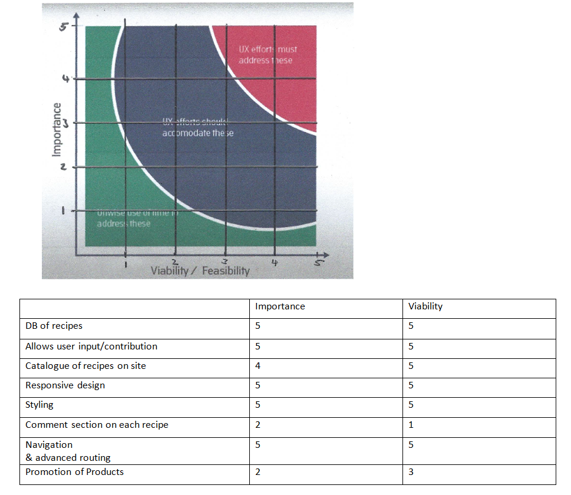
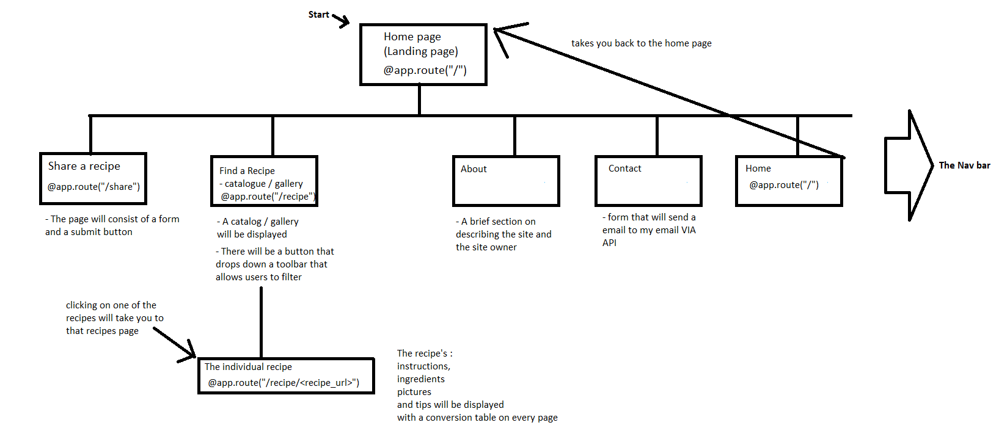
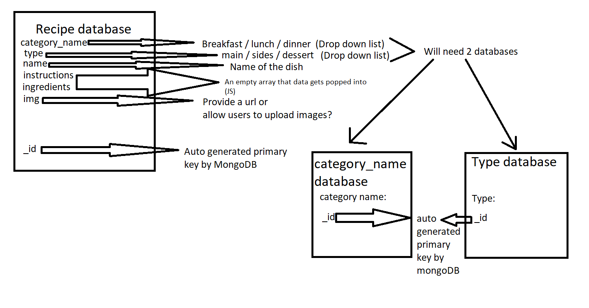
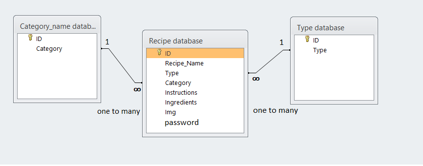
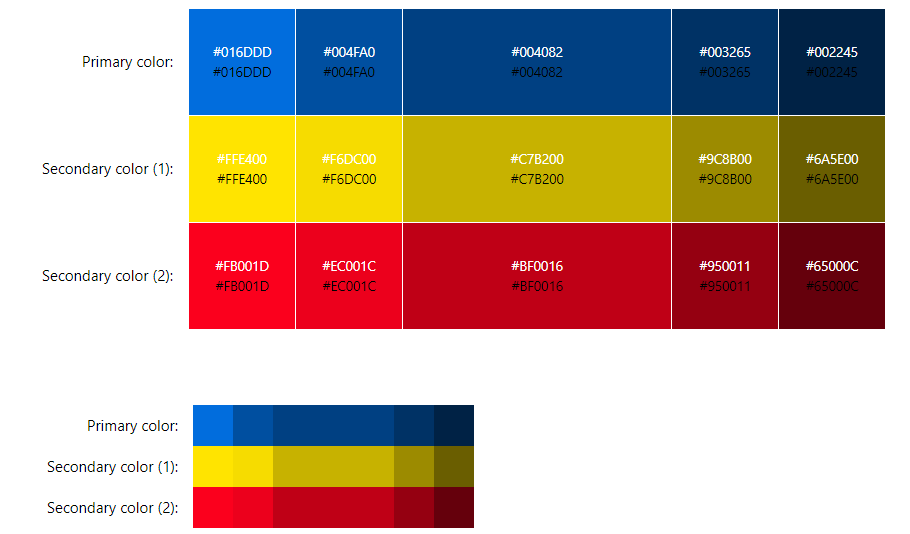

# Your Project's Name

One or two paragraphs providing an overview of your project.

Essentially, this part is your sales pitch.

## Table of contents

<!--ts-->

- [UX](#UX)
- [Features](#Features)
- [Technologies Used](#Technologies-Used)
- [Testing](#Testing)
- [Deployment](#Deployment)
- [Credits](#Credits)
<!--te-->

---
 
## UX
### High level considerations
-	Looking at the target audience: This is a very culturally appropriate project. It is a web app that focuses on sharing recipes. 
-	Anybody can use this web app. The content will focus on recipes and food. 
-	Can we track and catalogue the content in an intuitive way? 
-	The content will be entered into a database and be displayed to the different pages
-	Cook books require people to buy the books while this web app provides the recipes for free
-	The technology we are using is very modern: HTML5, CSS3, JavaScript, Python and MongoDB

### Business goals 

Due to the assessment, business goals are negligible. 

### Strategy Trade Off 


-	I am making a Web app that allows people to find and share recipes  
-	The value we provide is to be able to quickly find recipes and share them. 
-	Anyone is allowed to use the website (Due to this I am reluctant to use a login system)
-	People looking for recipes are people who do not know what to make for breakfast/dinner/lunch so we aim to provide as many recipes for these as possible. 
-	Competitors normally share their recipes in a blog which makes it tedious because as a user, we do not care about the blogger’s life story regarding that recipe, we just want the recipe. 
-	Competitors who share their recipes on non-blog sites normally share gifs of their recipe on forums (Reddit) but without knowing that you can control the gif makes it long to find the next step because you will have to wait for the gif to replay before you can see the next step. 
-	User needs: 
    - Easily find and share recipes 
-	Site owners goal:
    - Promote cooking equipment (AMC Classic (?)) [maybe]
-	Will need to include instructions on site for single use learning

- "First Use" Questions need to be answered so that the  user knows what to expect and what to do next.




#### The trade Off

- I have rated each feature from 1 - 5 (where 1 is the least and 5 is the most) on importance and viability

- First I add up the total on importance, which is 33

- Then I find my average viability, which is 4.25. Then I multiply that by the 
number of items, which is 34. 

- My importance "value" is 33 and my viability is 34. Thus viability > importance
    - this means that all features can be implemented

- Depending on the time constraints the items with the lowest importance will be incorporated last

### Scope Plane trade off

- The features that are open for discusion at the moment (16/11/2020) [DD/MM/YYYY] is the Promotion of Products and the comment section on each recipe becuase they have the lowest 
viability of all the features

- the project should be done within 3 weeks 
    - I have 21 days to implement 8 features
    - This means one feature should be implemented every +-3 days  

#### comment section on each recipe
- I believe using advanced routing features in python (hypothetically) I can redirect
a user to a individual page to a dedicated recipe as follows: 

```       
    @app.route("/recipes/<recipe_url>") 
    def about_recipe(recipe_url):
    # I am creating an empty dictionary
        recipe = []
        # I am expecting this to return a collection of food names
        with mongo.db.food.find_all("food_name") as food_data:
            # I am allocating the collection of food names into a variable 
            data = food_data
            for obj in data:
                # each recipe put into the database will have a url which
                # will be the name of the food but on submission the correct .methods
                # will be used for exmaple:  .replace(" ", "_") and .lower()
                if obj['url'] == recipe_url
                    recipe = obj
        return render_template("recipe.html", recipe=food)
```
- then on the `recipe.html` which is being rendered there will be a input box where, on submission
will display directly to the page using jinja syntax. 

- an issue with this is:
    - if there is no login system (as stated above) all comments will just appear as paragraphs and will not
    satify the first time learning and lead to a bad UX. 
    - if there is a login system then further research will have to be done to be
     able to incorporate a voting system to rate the most helpful comments and
      to permanently show each comment to the correct url. 
        - this leads to another issue: how do I prevent a user voting more than once?
        - another issue is that many users using the app are just visitors and will not ant to sign up to this system
    - This means another database needs to be established.

- I believe the comment section should not be included. This is to be disccused in the future in greater detail

#### Promotion of products

- This seems more viable than the comment section 
- A local Json file can be established with images, names and links 
of certain cooking equipment used in the different recipes and these can be
 used to promote products. (linkin user to the Official product site)

### Scope Plane requirements
- I conducted an interview with my family regarding this section asking them 3 main questions
    - what the users say they need
        -  One User wanted a conversion Table
            - this can be incorporated under each recipe's individual page 
        - One user wants media - photos/gifs of the recipe
            - this can also be incorporated in each recipe's individual page
            - more than 1 images will have to be in a gallary
        - Users said they wanted a difficulty level for each recipe
        - One user said they wanted cooking tips at the side but this is so niche to each recipe
            - what I can do is include a "tips" section in the submission form and this will be displayed as cards on the recipe's page
                - this will make the data size of each netry a bit larger
                - There can be a limit of 3 tips to make sure the most important tips are given
        - Another user wanted the recipes to already be on the app but this defeats the purpose of the goal: to be able to share recipes
        - Users want to know if the recipe was tested by different users
            - This brings up the problem of the login system which will not be incorporated
        - Users wanted categories for each recipe
            - main course, sides, desserts etc...
            - There has to be a limit of categories
                - that means once the category is created, it stays there. No admin control would exist
        - Users wanted cooking "teachings" to teach people using the app how to cooking
            - but this misses the site's goal and can be considered negligable 
        - Users wanted a filtering system to be able to filter their searches by difficulty
            - this can be done by creating an index in mongoDB 
    - what they actually need 
        - Users were unaware of the requirements:
            - to have a responsive design 
            - to have a navigation system
        - users wanted to share the recipes via pictures but this going to lead to recipes being misread and/or misunderstood
    - what they do not know they need
        - The submission form here is crucial since this is the only logical way to get the recipe online in a clear and comprehensive manner.
        - Users were unaware of the importance of the colour scheme

### Scope Plane requirement types

- Looking at the content requirements there will be a lot of mixed content of the multiple pages
    - Images/ gifs, Cards, Ordered and Unordered lists with a lot of text


- considering the viability of the scope plane requirements I would say that the requirements 
we can include (outside of the initial features) are:
    - The conversion Table
    - media/ gifs of the recipe
    - The categories for when the meal is applicable (dinner/lunch/breakfast etc). these will be stored in a database and they will be part of a drop down list in the submission form
    - The filtering system
- the requirements can't include due to viability is:
    - The difficulty level
        - I support this idea but difficulty is relevant: Gordon Ramsey might find roast beef simple but a 15 year old could find it challenging/dangerous
    - The cooking tips
        - I can attempt to include this but if it makes the database full then it will probably not be included


- The requirements listed are not features but they are "nice to haves"
- Incorporating them could round off this project quite nicely and make the projects seem more useful, buildable, objective annd functional

- A non-functional requirement I am seeing is scalability 
    - I will have to move to a better, larger server if the traffic gets too being
    - this means setting up new environment variables which can be done but will definetvly cost money

### Structure Plane concerns

- The following diagram displays how I plan to organize the functionality & content 
of the site and how a user might navigate through the site intuitivly 



- The user will start at the landing page 
- At the top will be a nav bar with 5 sections: Share, Find, About, Contact and Home
    - Share will be a submission form
    - Find will be a gallary/catalogue with a filter that uses advanced routing
     to direct a user to an individual recipe
    - About will give a bit more information on the project's background
    - Contact will be a form that emails me complaints using an API 
    - Home will take a user to the landing page

- The plan is to have a linear hyperlinked structure that is simple enough
 for users to navigate through but complex enough to include a lot of information


### Interaction design 

- Firstly looking at how the databases are going to be set up: I have designed a rough sketch in my head 

- The Recipe database will be the "main" database where each entry will have 7 attributes:
    - Category_name: This will "categorise" the recipes for the filtered searches
    for what meal type is appropriate (see diagram)
    - type: The will also categorise the recipes for the filter system. 
    - Category_name and type will be a foreign key to the category_name databses and to the Type database
    - Name: will be the name of the recipe
    - instructions and ingredient: these two fields will be in the form of an array of strings. By using Java Script 
    I plan to created more input fields in the form. For each input field (for the two attributes), that will get pushed into the corresponding array to MongoDB. 
        - To get this to appear on the recipe's page, I will filter through each item in the array displaying the ingredients in an `<li></li>` child of 
    an `<ul></ul>` and the instructions in an `<li></li>` that is a child of an `<ol></ol>`
    - Img: this will be a url of a gif or a image of the meal 
    - Finally each databse will have a Primary key autogenerated by MongoDB called "_id"


This is my attempt at trying to draw an ERS diagram of the databases


- Looking at the interactive systems discussed so far:
    - The gallery/catalogue of recipe cards to click on
        - each recipe will be in a card which when clicked on will take you to that recipe's page
        - there will be a filter button above all the cards that drops down a filter "tool bar" with buttons
            - the category and type for each recipe will be indexed so that it can be searched for
            - activated buttons will do the filtering
    - The submission form to submit recipes
        - there are input fields to enter data 
        - if more ingredients/instructions need to be added there will be a button that "reveals"/"adds" more input fields
        - on submission the form's data will get pushed to the database where the recipe will be on display in the "Find" section
    - The contact page to contact the page owner
        - This will be a simple form that will send emails to me
        - I will use an API for this
        - Data input includes: Name, Surname, Email and a message which will be the body of the email
- There will have to be instructions presented to the users on each input field to reduce the risk of error
- The Site will try to Leverage from Prior experience by assuming the user has an expectation of convention
    - Like having the Nav Bar at the top of the page

- The Theme of the page will be consistant and will use the following pallete:


- By using a Library like bootstrap or materialize (will see which will be more beneficial once in the building phase) the voice of the site will remain consistant and stable

- Due to the simplicity of the structure of the site, the app/site should be very learnable

### information Architecture

- This section is responsible for the creation of organisation and navigational schemes which has already been discussed in the structure plane concerns and 
the interaction design. 

- the architecture, I believe, is done correctly so that when changes are made the architecture can accomodate those changes

- The architecture forms a Tree Structure which is relatively standard
    - This is known to be problematic on Mobile but with the ease of a burger icon, I plan to reduce those problems

### Principals of organisation

- The way data will be organised 

## Features

In this section, you should go over the different parts of your project, and describe each in a sentence or so.
 
### Existing Features
- Feature 1 - allows users X to achieve Y, by having them fill out Z
- ...

For some/all of your features, you may choose to reference the specific project files that implement them, although this is entirely optional.

In addition, you may also use this section to discuss plans for additional features to be implemented in the future:

### Features Left to Implement
- Another feature idea

## Technologies Used

In this section, you should mention all of the languages, frameworks, libraries, and any other tools that you have used to construct this project. For each, provide its name, a link to its official site and a short sentence of why it was used.

- [JQuery](https://jquery.com)
    - The project uses **JQuery** to simplify DOM manipulation.


## Testing

1. Testing if Project deploys successfully to Heroku: (Sha: 937c8b93b29328c060febef617a9b8f7421e3a7d)
    - after the [Deployment](#deployment) sequence I pushed my work to GitHub
    - I got a jinja error
    - I revisited my app.py file and saw I rendered the wrong template which does not exists
    - To fix this I renamed the template the to correct corresponding template which does exists (sha: 079dc6719fb3d9ca5ac7e4859456d2a042d8becd)
    - app now successfully launches to Heroku. 

In this section, you need to convince the assessor that you have conducted enough testing to legitimately believe that the site works well. Essentially, in this part you will want to go over all of your user stories from the UX section and ensure that they all work as intended, with the project providing an easy and straightforward way for the users to achieve their goals.

Whenever it is feasible, prefer to automate your tests, and if you've done so, provide a brief explanation of your approach, link to the test file(s) and explain how to run them.

For any scenarios that have not been automated, test the user stories manually and provide as much detail as is relevant. A particularly useful form for describing your testing process is via scenarios, such as:

1. Contact form:
    1. Go to the "Contact Us" page
    2. Try to submit the empty form and verify that an error message about the required fields appears
    3. Try to submit the form with an invalid email address and verify that a relevant error message appears
    4. Try to submit the form with all inputs valid and verify that a success message appears.

In addition, you should mention in this section how your project looks and works on different browsers and screen sizes.

You should also mention in this section any interesting bugs or problems you discovered during your testing, even if you haven't addressed them yet.

If this section grows too long, you may want to split it off into a separate file and link to it from here.

## Deployment

Link to the live page: https://keis5ingredientsfoods.herokuapp.com/ 

To deploy this project I followed the following steps:
1. I created my env.py file where I created my variables (IP, Port, MONGo_URI, MONGO_DBNAME and a secret key for flashed massages)
2. I used the CLI to install all my frameworks and collected them inside the requirements.txt file (See requirements.txt)
3. I created my procfile for heroku stating that it should run app.py as a web app and it uses the python language
4. I created my MongoDB and connected to it
5. I went to https://dashboard.heroku.com/apps and created my new app
6. I connected to my GitHub repository via Heroku
7. I then went to setting and added my configuartion variables (same variables as in my env.py file)
8. I connected to my master branch and this is the final step of deployment 

In particular, you should provide all details of the differences between the deployed version and the development version, if any, including:
- Different values for environment variables (Heroku Config Vars)?
- Different configuration files?
- Separate git branch?

In addition, if it is not obvious, you should also describe how to run your code locally.


## Credits

### Content
- The text for section Y was copied from the [Wikipedia article Z](https://en.wikipedia.org/wiki/Z)

### Media
- The photos used in this site were obtained from ...
- The colour scheme was created by me, Inspired by [this arcticle](https://www.quora.com/What-color-scheme-to-choose-for-food-website) but I used [Palleton](https://paletton.com/#uid=1000u0kllllaFw0g0qFqFg0w0aF)

### Acknowledgements

- I received inspiration for this project from X
