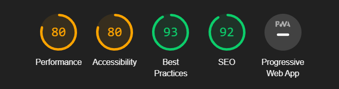

# Testing

## Tests

1. Testing if Project deploys successfully to Heroku: (Sha: 937c8b93b29328c060febef617a9b8f7421e3a7d)
    - After the [Deployment](#deployment) sequence I pushed my work to GitHub
    - I got a Jinja error
    - I revisited my app.py file and saw I rendered the wrong template which does not exists
    - To fix this I renamed the template to the correct corresponding template which does exist (sha: 079dc6719fb3d9ca5ac7e4859456d2a042d8becd)
    - App now successfully launches to Heroku. 

2. Testing if CSS and JS files are successfully connected to the base.html
    - In the base.html I linked JQuery, my CSS file (static/css/style.css using Jinja) and my JavaScript file (static/js/main.js using Jinja)
    - I changed the font colour in the CSS file and the h1 font changed - Thus successful 
    - I added a button to base.html and added JQuery code to my JavaScript file that will change the background colour and the font colour 
        - on click the button changed colour and background colour - Thus successful
    - My CSS file and JavaScript files are successfully connected

3. Testing the "responsive" images of cards in applainces.html
    - I first set all images to have dimensions 100px X 100 px
    - Not all devices supported these dimensions
    - I added media queries in style.css to change dimensions of the images appropriately 
    - Due to the layout it was not successful 
    - I changed the layout of the cards and changed some values in the media Queries 
    - Cards now successfully show the images and are appropriate for the following devices (in portrait and Landscape):
        - Laptops
        - Moto G4
        - Galaxy S5
        - Pixel 2/2XL
        - IPhone 5/SE/6/7/8/8 Plus/X
        - IPad & IPad Pro
        - Surface duo 
        - Galaxy Fold 

4. Testing if form submits recipe to MongoDB
    - I filled the form with test data and added "extra" data to instructions and ingredients (To test if an array will store the different instructions and ingredients)
    - Form does not submit to MongoDB
    - I added a different collection as the target for the insert function
        - This did not work 
    - I added a method and a action to the form 
        - The form submits the data to the wrong collection
    - I changed the collection back to the original target for the insert function
    - Form now submits correct data to the right collection 

5. Rendering recipe.html 
    - I added the corresponding app route and Jinja returned a Type Error saying that I cannot iterate over the object
    - I removed the Jinja for loop and my page rendered but the injected data does not show up
    - I changed the collection from recipe to recipes in the route 
    - Data from the collection now renders to recipe.html successfully 

6. Getting the update button to load data on the update.html page
    - In recipe.html I added a update button which parses a variable (Recipe ID) to app.py
    - I created a app route and function in app.py that renders update.html and takes the parsed variable as a parameter
    - I tried to look for the recipe ID and got a `bson.errors.InvalidId error: 'recipe' is not a valid ObjectId, it must be a 12-byte input or a 24-character hex string`
    - I renamed variables in the HTML file and I renamed variables in the python file so that the word recipe does not appear in the error but it still does.
    - A soon as I restarted the app the error was gone and my page loaded successfully

7. Testing if Updating a Recipe works
    - I am using the "Test" Recipe 
    - I will change the name to "Test2" and click on update 
    - A new recipe was created
    - I went back to the update submission form and changed the action from `action="{{ url_for('share') }}"` to `action="{{ url_for('update') }}"`
    - I went back to MongoDB and removed Test2
    - I am going to open up the test recipe again in find.html and I will attempt to update its name to "test2"
    - I got a Jinja error, I changed `return redirect(find.html)`, I copied and pasted code from the view of `find()` into my function
    - After updating a User is taken to the `find.html` page successfully.

8. Testing if good code was used: 
    1. CSS 
    - Firstly I copied my CSS into Auto-Prefixer (see credits)
    - I saw nothing changed in the output, Thus I assumed no bad CSS was written
    - Still copied the output and pasted it into my code so that I accredit the site. 
    2. HTML 
    - I ran my HTML through the w3 validator service
    - The only error I got as "bad value" relating to my jinja, thus good HTML has been written
    3. JavaScript
    - I copied and pasted the code in my JavaScript file into JSHint (see credits)
    - I received 9 warning where 8 referred to my use of 'let' which is a key word, this is fine.
    - I received a warning that a semicolon was missing in line 37, which I added back in
    4. Python
    - Unfortunately I was unable to find a testing service for my python code.
    - But assuming that all the desired outputs were achieved and no horrible bugs appeared, I can consider the code to be good. 

9. Testing login and registration functionality:
    1. Registration
        1. Successful registration
            - I went to the register form and entered `KeisG` as the username
            - I entered a custom password: `helloworld`
            - clicked on register button
            - I was redirected to the home page and a flashed message appears - Thus successful
        2. Unsuccessful registration
            - following the same procedure as above, I entered the username `   ` (3 spaces) with the password`!@#$%^&*()`
                - Form did not submit as expected - thus successful - got a error in the username field
            - following the same procedure as above, I entered the username `HENRE`(acceptable username) with the password`!@#$%^&*()`
                - Form did not submit as expected - thus successful - got a error in the password field
    2. Login
        1. Successful login
            - Going to the login page I enter the registered user `KeisG`'s data as stated above
            - After clicking login I am taken to the homepage with a flash message - Thus successful
        2. Unsuccessful login
            - Going to the login page I enter unregistered data: 
                - username: `JohnnyNoxville`
                - password: `backflip`
            - Remaining on the login in page a flash message appears saying "Incorrect username and/or password"
            - Thus Unsuccessful login functionality works. 

10. Testing User stories
    1. Non-registered users
        - Finding a recipe
            * Click on the "Find" button in the Nav bar
            * A search bar is present to search recipes by name 
            * Cards are available to click on for Individual recipes 
        - Becoming a registered user
            * Click on the "login/register" button in the nav bar
            * Login form appears with a registration link below it - click on that link - takes me to the registration form
            * Form can be filled in to register - Works successfully

    2. Registered User
        - Share
            * Click on the "share" button in the Nav bar - a form appears and a recipe for Hot Chocolate is entered and submitted
            * User is redirected to that recipe's Individual page with a flash message - Sharing works
        - Update
            * Click on a random recipe not created by **THIS** user - no update button displayed
            * Click on a random recipe created by **THIS** user - update button displayed 
            * Click on update button displayed takes user to a form with that recipe's data loaded 
            * Changing the data and clicking submit changes that recipe - Update successful
        - Delete
            * Click on a random recipe not created by **THIS** user - no delete button displayed
            * Click on a random recipe created by **THIS** user - Delete button displayed 
            * Click on delete button triggered a warning modal with 2 buttons - cancel and delete
            * Clicking on cancel closes the modal
            * Clicking on delete deletes the recipe and closes modal - Delete Successful
        - Sign in 
            * Click on the login/register button in the Nav bar
            * Enter the credentials of a non-registered user and loggin in results in a flash warning appearing
            * Enter the credentials of a registered user and click on login - user successfully logged in 
        - Log out
            * Only when logged in is this available
            * Click on Logout in the Nav Bar and the session cookie is cleared and a user is logged out - successful

    3. Administrator
        - Promote cooking appliances 
            * Any user can click on "appliances" in the nav bar and cards are displayed with Individual cooking appliances displayed 

11. Lighthouse chrome testing 

By opening up lighthouse in the chrome developer tools I ran a report. This reminded me to add alt tags to images and download all my images and store them in my img directory. It also requested me to get rid of some of my dependencies but since they are dependencies, this is not possible. Lighthouse recommended changing the image file format, but I do not know how to do this. I will remember to do this in future projects. 

Lighthouse recommended changing the contrast between labels and their corresponding backgrounds. These labels were taken directly off materialize and as such I expect them to be designed with UX in mind. Therefore the contrast will not be changed. 

## Variations

- Variation in browsers and screen sizes
    - I have not seen any massive changes in the project in different browsers
        - Browsers that have been tested include:
            * Chrome - PC & Mobile
            * Firefox - PC
            * Safari - Mobile
            * Mi Browser - Mobile
    - Regarding Screen Sizes I have seen a change in the logo name in the Nav Bar
        - On mobile the word "foods" is cut off - I attempted to change the layout in the dev tools in chrome; no successful middle ground can be found
            - This is due to the library - materialize - that this is not possible
    - On mobile the images render differently but they do not change the overall layout of the site

## Bugs

- All bugs have been mentioned in the [tests](#Tests) section

